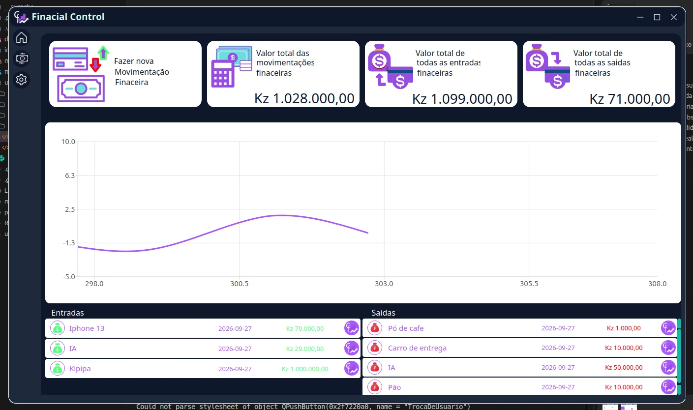
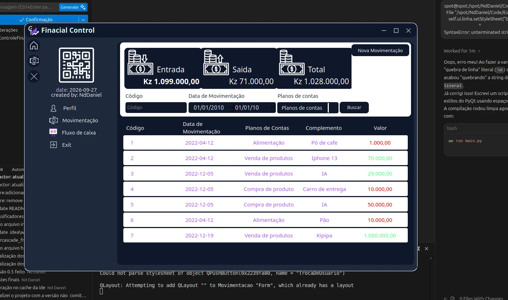
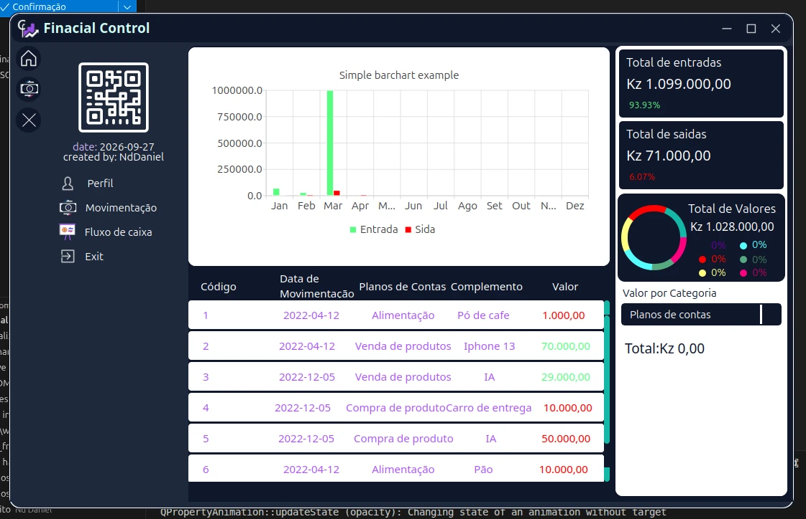

# Controle Financeiro 📊

**Controle Financeiro** é uma aplicação desktop de gestão financeira desenvolvida em Python para facilitar o controle de finanças de forma intuitiva e visual. Conta com recursos analíticos, gráficos dinâmicos e uma interface moderna. O sistema também integra visão computacional (reconhecimento facial) para segurança.

## 🚀 Funcionalidades e Destaques

- **Dashboard Completo:** Indicadores-chave de desempenho (Resumo de saldos, entradas e saídas).
- **Interface Moderna (UI):** Responsiva e desenvolvida com PySide6, com navegação lateral dinâmica (Sidebar) expansível e colapsável.
- **Gestão de Movimentações:** Rastreamento detalhado de transações financeiras com identificação visual por cores (créditos e débitos).
- **Análise Avançada de Fluxo de Caixa:** Gráficos de barras agrupadas e distribuição por categoria (donut chart) para análise clara e visual.
- **Filtros Robustos:** Pesquise transações por código, intervalo de datas e categoria.

## 🛠 Tecnologias Utilizadas

- **Python** (>= 3.10)
- **PySide6 / Qt6** (Interface Gráfica e MVC)
- **QtCharts** (Gráficos Analíticos e Dashboards)
- **OpenCV** (`opencv-contrib-python`)

## 📸 Telas do Sistema (Novo Design)

### 🏠 Dashboard / Página Inicial

*Home com Cards de Resumo e Gráfico de Linha Mensal.*

### 💱 Gestão de Movimentações

*Página de movimentações listando entradas e saídas detalhadas com barra lateral expandida.*

### 📊 Análise de Fluxo de Caixa

*Análise de fluxo de caixa com gráfico de barras comparativo e tabela resumo.*

## 🎥 Demonstrações em Vídeo
- [Demonstração Principal - Dashboard e Fluxo de Caixa](.portfolio/videos/01-demo-main.mp4)
- [Demonstração - Gestão de Movimentações](.portfolio/videos/02-demo-movements.mp4)

---
*Desenvolvido como Projeto Escolar.*
